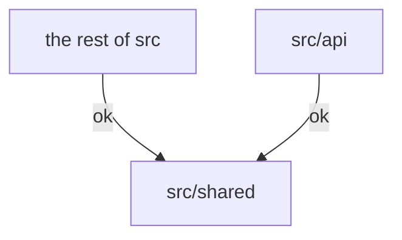

# Yuanjian App - 远见教育平台

A Web app that supports mentorship programs at [Visionary Education Foundation (远见教育基金会)](http://yuanjian.org), developed by VEF volunteers.

## Getting Started

1. Install `node.js` and `yarn`
1. Install `postgresql` and start it locally. Aternatively, create a remote test db at [Neon](http://neon.tech).
1. Create file `.env.local` in the repository root, and:
   - If you are an active Yuanjian volunteer, copy content from [this Notion page](https://www.notion.so/yuanjian/env-local-fde6a9fbc7854a5da2a08425b6562724) and follow instructions on this page to set undefined variables.
   - Otherwise, copy content from `.env.template` and follow instructions in this file to set undefined variables.
1. Run `yarn` to install dependency packages.
1. Run `yarn sync-database` to initialize the database.
1. Run `yarn dev` to start local server. By default it will listen on [`localhost:3000`](http://localhost:3000).
1. Visit this local server from broswer. Log in with your email.
1. Run `yarn gen-test-data` to populate test data.
1. Finally, restart your local server to clean up server cache and read pupulated data fresh.

## Frameworks Used

- Frontend and backend powered by [Next.js](https://nextjs.org/).
- End-to-end type safety with `typescript`, [`trpc`](https://trpc.io/), `zod` and `class-validator`.
- UI styling and components from [Chakra UI](https://chakra-ui.com/).

## Code Structure

We extend `next.js`'s [code structure](https://nextjs.org/docs/getting-started/project-structure#top-level-folders):

|  |  |
|---|---|
| `public` | Static assets. |
| `src` | Source folder. Files under `src` but outside of `src/api` may be executed either in the browser or on the server. |
| `src/api` | Files to be executed on the server only. |
| `src/horzion-ui` | [Horizon UI](https://github.com/horizon-ui/horizon-ui-chakra-nextjs/) source files. See [`src/horizon-ui/README.md`](src/horizon-ui/README.md) for details. |
| `src/pages` | `next.js` [Page Router](https://nextjs.org/docs/pages/building-your-application/routing). Migrating to App Router remains future work. |
| `src/shared` | Files shared between `src/api` and the rest of `src`. |
| `tools` | Command-line scripts.

**IMPORTANT**: To prevent security and programming issues,

* files in `src/shared` must not refer to files outside of `src/shared`,
* files in `src/api` must not refer to files outside of `src/api` or `src/shared`, and
* files outside of `src/api` must not refer to files in `src/api`.

That is, only the dependencies demonstrated below are allowed:

## FAQ

Q: What to do if I got `'TS_NODE_PROJECT' is not recognized as an internal or external command ERROR`?

A: Add `cross-env` in front of  `TS_NODE_PROJECT...` in package.json

