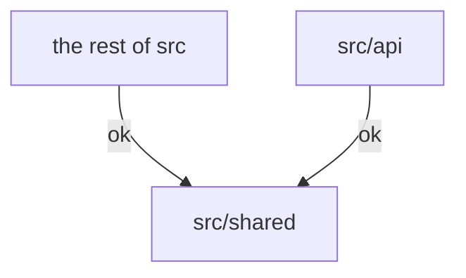

# 社会导师服务平台

This is a web app that supports mentorship programs at [Visionary Education
Foundation (远见教育基金会)](http://yuanjian.org) developed by VEF volunteers.

## Getting Started

1. Install `node.js` and `yarn`.
1. Install `postgresql`, start it locally, and create a database called `yuanjian`. Aternatively, use a hosted Postgres solution such as [Neon](http://neon.tech).
1. Create file `.env` in the repository root with the following content:
   ```
   DATABASE_URI=postgres://localhost/yuanjian
   NEXTAUTH_SECRET=123
   ```
   Optinoally, see [`.env.template`](.env.template) for more environment
   variables you can set in `.env`.
1. Run `yarn` to install dependency packages.
   - If you run into error `"$VERCEL_ENV" was unexpected`, see this [`doc`](./docs/package.json.md).
1. Run `yarn migrate-db && yarn gen-demo-data` to initialize the database.
1. Run `yarn dev` to start local server. By default it will listen on [`localhost:3000`](http://localhost:3000).
1. Visit the local server from broswer. Sign up with email `admin@de.mo`.
   - When prompted to enter a verification code, find the `"token": "..."` string from `yarn dev`'s command-line output and enter the six-digit token.
1. If you use MacOS, run `chmod ug+x .husky/*` to activate husky/git hooks.

## Architecture and Development Guidelines

* [deepwiki.com/yuanjian-org/app](https://deepwiki.com/yuanjian-org/app)
* [Cursor rules](.cursorrules) (mainly auto generated)
* [Coding style](docs/CodingStyle.md)

## Code Structure

We follow [next.js convention](https://nextjs.org/docs/getting-started/project-structure#top-level-folders):

|  |  |
|---|---|
| `public` | Static assets. |
| `src` | Source folder. Files under `src` but outside of `src/api` may be executed either in the browser or on the server. |
| `src/api` | Files to be executed on the server only. |
| `src/pages` | `next.js` [Page Router](https://nextjs.org/docs/pages/building-your-application/routing). Migrating to App Router remains future work. |
| `src/shared` | Files shared between `src/api` and the rest of `src`. |
| `tools` | Command-line scripts. |
| `cypress/e2e` | End-to-end tests. See [`documentation`](cypress/README.md). |

To prevent security and programming issues, eslint [is configured](./.eslintrc.json) to enforce the following rules:

* files in `src/shared` must not refer to files outside of `src/shared`,
* files in `src/api` must not refer to files outside of `src/api` or `src/shared`, and
* files outside of `src/api` must not refer to files in `src/api`

That is, only the dependencies demonstrated below are allowed:



## Testing

1. Run `yarn test` to run all unit tests.
   - If you run into error `TS_NODE_PROJECT' is not recognized as an internal or external command`, see this [`doc`](./docs/package.json.md).
1. See [this doc](./cypress/README.md) for end-to-end testing.

## More Documentation

Browse the [`docs`](./docs/) folder.
