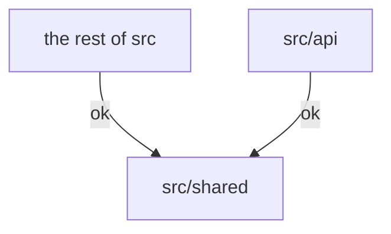

# 远图教育平台

远图 is a web app that supports mentorship programs at [Visionary Education Foundation (远见教育基金会)](http://yuanjian.org),
developed by VEF volunteers.

## Getting Started

1. Install `node.js` and `yarn`.
1. Install `postgresql` and start it locally. Aternatively, create a remote test db at [Neon](http://neon.tech).
1. Create file `.env.local` in the repository root, and:
   - If you are an active Yuanjian volunteer, copy content from [this Notion page](https://www.notion.so/yuanjian/env-local-fde6a9fbc7854a5da2a08425b6562724).
   - Otherwise, copy content from [`.env.template`](.env.template) and configure required fields.
1. Run `yarn` to install dependency packages.
1. Run `yarn sync-database` to initialize the database.
1. Run `yarn dev` to start local server. By default it will listen on [`localhost:3000`](http://localhost:3000).
1. Visit the local server from broswer. Sign up with your personal email address.
   - When prompted to enter a verification code, find the `"token": "..."` string from `yarn dev`'s command-line output and enter the token as the code.
1. Run `yarn gen-test-data` to finish setup and populate test data.
1. If you use MacOS, run `chmod ug+x .husky/*` to activate husky/git hooks.

## Code Structure

We follow [next.js convention](https://nextjs.org/docs/getting-started/project-structure#top-level-folders):

|  |  |
|---|---|
| `public` | Static assets. |
| `src` | Source folder. Files under `src` but outside of `src/api` may be executed either in the browser or on the server. |
| `src/api` | Files to be executed on the server only. |
| `src/pages` | `next.js` [Page Router](https://nextjs.org/docs/pages/building-your-application/routing). Migrating to App Router remains future work. |
| `src/shared` | Files shared between `src/api` and the rest of `src`. |
| `tools` | Command-line scripts. |
| `cypress/e2e` | End-to-end tests. See [`documentation`](cypress/README.md). |
| `llm` | Code for large language models. See [`documentation`](llm/README.md). |

To prevent security and programming issues, eslint [is configured](./.eslintrc.json) to enforce the following rules:

* files in `src/shared` must not refer to files outside of `src/shared`,
* files in `src/api` must not refer to files outside of `src/api` or `src/shared`, and
* files outside of `src/api` must not refer to files in `src/api`

That is, only the dependencies demonstrated below are allowed:

## Testing

1. Run `yarn test` to run all unit tests.
1. See [this doc](./cypress/README.md) for end-to-end testing.

## More Documentation

Browse the [`docs`](./docs/) folder.
